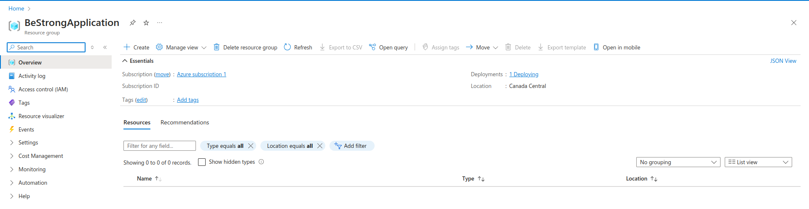
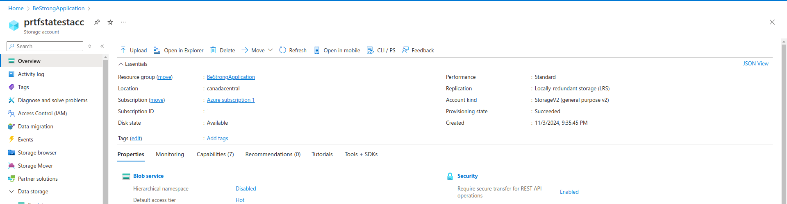
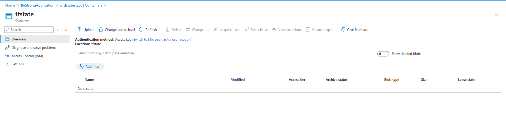
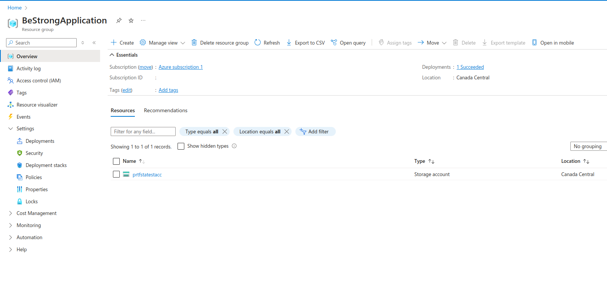
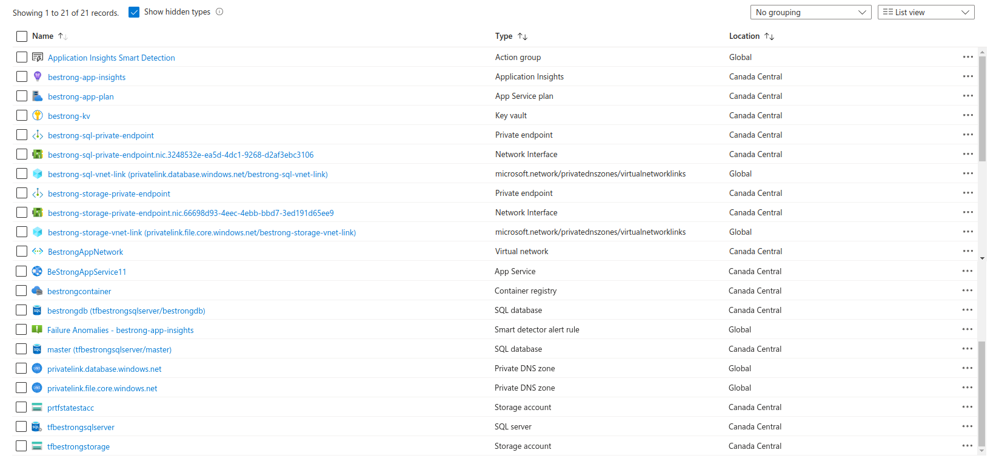
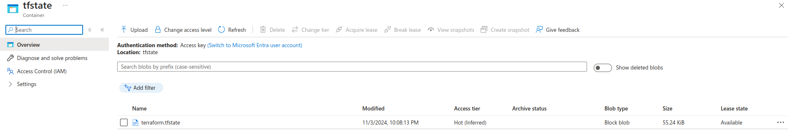
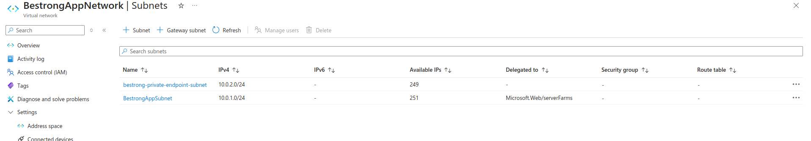
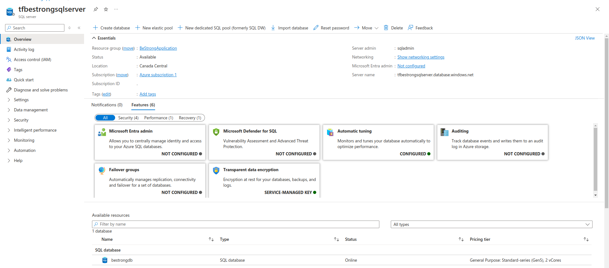
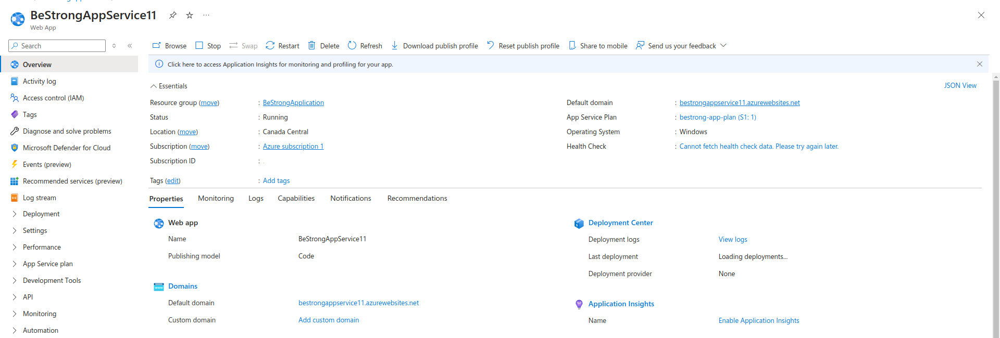

# terraform-bestrong

## Task:
### Write Terraform code for configuration of the following bunch of resources:
    -1 App Service Plan
    -1 App Service - integrate with VNet, enable System Managed Identity
    -1 Application Insights - linked to App Service
    -1 ACR - Azure Container Registry, grant App Service Identity access to it
    -1 Key Vault - grant permissions to App Service Identity, integrate with VNet
    -1 VNet
    -1 MS SQL Server DB - Private Endpoint needs to be configured
    -1 Storage account - configure Private Endpoint with VNET and mount Fileshare to App Service
    -1 Storage account for Terraform state
    -Create infrastructure using Terraform in CloudGuru Sandbox, or, if there are some environment limitations - on your Azure subscription.
    -Terraform state should be stored in remote backend - Azure storage account.


# Screenshot of the completed task
## Created Resource Group "BeStrongApplication"

## Storage Account "prtfstatestacc"

## Container "tfstate"

## Before Deployment(terraform apply)

## After Deployment(terraform apply)

## Content in Container "tfstate" - terraform state file

## VNet with Subnets

## SQL Server with SQL Database

## App Service for BeStrong(BeStrongAppService11)


# Description of files

## 1 App Service Plan and 1 App Service
### appservice.tf - Configuration for App Service and App Service Plan
```
resource "azurerm_app_service_plan" "bestrong_plan" {
  name                = "bestrong-app-plan"
  location            = data.azurerm_resource_group.rg.location
  resource_group_name = data.azurerm_resource_group.rg.name
  sku {
    tier = "Standard"
    size = "S1"
  }
}

resource "azurerm_app_service" "bestrong_app" {
  name                = var.azurerm_app_service_name
  location            = data.azurerm_resource_group.rg.location
  resource_group_name = data.azurerm_resource_group.rg.name
  app_service_plan_id = azurerm_app_service_plan.bestrong_plan.id
  identity {
    type = "SystemAssigned"
  }
  site_config {
    vnet_route_all_enabled = true
  }

  depends_on = [
    azurerm_virtual_network.vnet
  ]
}

resource "azurerm_app_service_virtual_network_swift_connection" "bestrong_app_vnet_integration" {
  app_service_id = azurerm_app_service.bestrong_app.id
  subnet_id      = azurerm_subnet.subnet.id
}
```

## 1 Application Insights - linked to App Service
### acr.tf - Configuration for Application Insights, which linked to App Service
```
resource "azurerm_container_registry" "bestrong_acr" {
  name                = var.azurerm_container_registry_name
  resource_group_name = data.azurerm_resource_group.rg.name
  location            = data.azurerm_resource_group.rg.location
  sku                 = "Basic"
  admin_enabled       = true
}

resource "azurerm_role_assignment" "acr_pull_permission" {
  scope                = azurerm_container_registry.bestrong_acr.id
  role_definition_name = "Owner"
  principal_id         = azurerm_app_service.bestrong_app.identity[0].principal_id
}
```
##  1 Key Vault - grant permissions to App Service Identity, integrate with VNet
### keyvault.tf - Configuration for Key Vault, grant permissions to App Service Identity, integration with VNet
```
resource "azurerm_key_vault" "bestrong_kv" {
  name                = "bestrong-kv"
  location            = data.azurerm_resource_group.rg.location
  resource_group_name = data.azurerm_resource_group.rg.name
  tenant_id           = var.tenant_id
  sku_name            = "standard"
  network_acls {
    default_action             = "Deny"
    bypass                     = "AzureServices"
    virtual_network_subnet_ids = [azurerm_subnet.subnet.id]
  }
}

resource "azurerm_key_vault_access_policy" "bestrong_kv_policy" {
  key_vault_id = azurerm_key_vault.bestrong_kv.id
  tenant_id    = var.tenant_id
  object_id    = azurerm_app_service.bestrong_app.identity[0].principal_id

  secret_permissions      = ["Get", "List"]
  certificate_permissions = ["Get", "List"]
}
```

## 1 VNet 
### network.tf - Configuration for VNet. Also added configuration for subnet and private point 
### VNet
```
resource "azurerm_virtual_network" "vnet" {
  name                = var.azurerm_virtual_network_name
  location            = data.azurerm_resource_group.rg.location
  resource_group_name = data.azurerm_resource_group.rg.name
  address_space       = ["10.0.0.0/16"]
}
```
### Subnet
```
resource "azurerm_subnet" "subnet" {
  name                 = var.azurerm_subnet_name
  virtual_network_name = azurerm_virtual_network.vnet.name
  resource_group_name  = data.azurerm_resource_group.rg.name
  address_prefixes     = ["10.0.1.0/24"]

  delegation {
    name = "delegation"
    service_delegation {
      name = "Microsoft.Web/serverFarms"
      actions = [
        "Microsoft.Network/virtualNetworks/subnets/action"
      ]
    }
  }

  service_endpoints = ["Microsoft.KeyVault"]
}
```

### Private Point
```
resource "azurerm_subnet" "private_endpoint_subnet" {
  name                 = "bestrong-private-endpoint-subnet"
  resource_group_name  = data.azurerm_resource_group.rg.name
  virtual_network_name = azurerm_virtual_network.vnet.name
  address_prefixes     = ["10.0.2.0/24"]
}
```

## 1 MS SQL Server DB - Private Endpoint needs to be configured
### sql.tf - Configuration for  MS SQL Server DB with private endpoint. Additional: private dns zone.
### SQL Server
```
resource "azurerm_sql_server" "bestrong_sql" {
  name                         = "tfbestrongsqlserver"
  resource_group_name          = data.azurerm_resource_group.rg.name
  location                     = data.azurerm_resource_group.rg.location
  version                      = "12.0"
  administrator_login          = var.sql_adminstrator_login
  administrator_login_password = var.sql_adminstrator_login_password
}
```
### SQL Database 
```
resource "azurerm_sql_database" "bestrong_sql_db" {
  name                = "bestrongdb"
  resource_group_name = data.azurerm_resource_group.rg.name
  location            = data.azurerm_resource_group.rg.location
  server_name         = azurerm_sql_server.bestrong_sql.name
}
```
### Private EndPoint
```
resource "azurerm_private_endpoint" "bestrong_sql_private_endpoint" {
  name                = "bestrong-sql-private-endpoint"
  location            = data.azurerm_resource_group.rg.location
  resource_group_name = data.azurerm_resource_group.rg.name
  subnet_id           = azurerm_subnet.private_endpoint_subnet.id

  private_service_connection {
    name                           = "sqlPrivateEndpointConnection"
    private_connection_resource_id = azurerm_sql_server.bestrong_sql.id
    subresource_names              = ["sqlServer"]
    is_manual_connection           = false
  }
}
```
### Private DNS ZONE and Virtual Network Link
```
resource "azurerm_private_dns_zone" "bestrong_sql_dns" {
  name                = "privatelink.database.windows.net"
  resource_group_name = data.azurerm_resource_group.rg.name
}

resource "azurerm_private_dns_zone_virtual_network_link" "bestrong_sql_dns_vnet_link" {
  name                  = "bestrong-sql-vnet-link"
  resource_group_name   = data.azurerm_resource_group.rg.name
  private_dns_zone_name = azurerm_private_dns_zone.bestrong_sql_dns.name
  virtual_network_id    = azurerm_virtual_network.vnet.id
}
```

### Storage account - configure Private Endpoint with VNET and mount Fileshare to App Service.
### storage.tf - Configuration for storage account with Private Endpoint - VNET and mount Fileshare to App Service.
### Storage account

```
resource "azurerm_storage_account" "bestrong_storage" {
  name                     = var.azurerm_storage_account_name
  resource_group_name      = data.azurerm_resource_group.rg.name
  location                 = data.azurerm_resource_group.rg.location
  account_tier             = "Standard"
  account_replication_type = "LRS"
}
```
### Private Endpoint with VNET
```
resource "azurerm_private_endpoint" "bestrong_storage_private_endpoint" {
  name                = "bestrong-storage-private-endpoint"
  location            = data.azurerm_resource_group.rg.location
  resource_group_name = data.azurerm_resource_group.rg.name
  subnet_id           = azurerm_subnet.private_endpoint_subnet.id

  private_service_connection {
    name                           = "storagePrivateEndpointConnection"
    private_connection_resource_id = azurerm_storage_account.bestrong_storage.id
    subresource_names              = ["file"]
    is_manual_connection           = false
  }
}

resource "azurerm_private_dns_zone" "bestrong_storage_dns" {
  name                = "privatelink.file.core.windows.net"
  resource_group_name = data.azurerm_resource_group.rg.name
}

resource "azurerm_private_dns_zone_virtual_network_link" "bestrong_storage_dns_vnet_link" {
  name                  = "bestrong-storage-vnet-link"
  resource_group_name   = data.azurerm_resource_group.rg.name
  private_dns_zone_name = azurerm_private_dns_zone.bestrong_storage_dns.name
  virtual_network_id    = azurerm_virtual_network.vnet.id
}
```
### Fileshare
```
resource "azurerm_storage_share" "bestrong_file_share" {
  name                 = "fileshare"
  storage_account_name = azurerm_storage_account.bestrong_storage.name
  quota                = 10
}
```

## Additional files
### backend.tf - configures remote state storage.
### main.tf - configuration file for Azure and Resource Group in Azure. 
### variable.tf - defines input variables.
### azure_plan - File config(plan) for terraform apply

